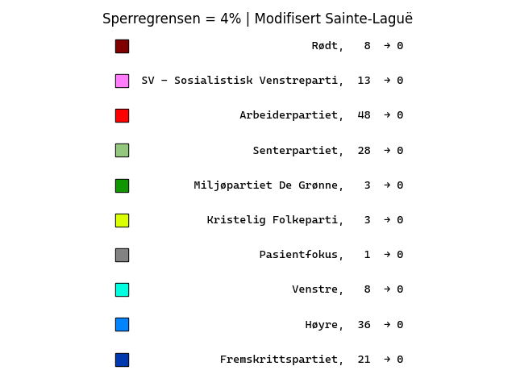
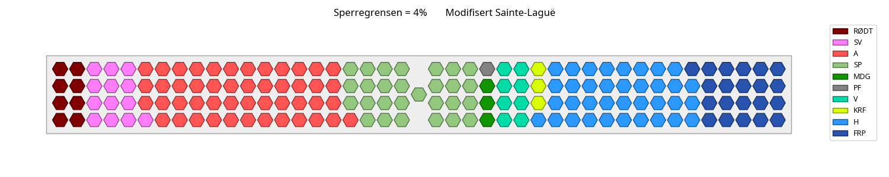
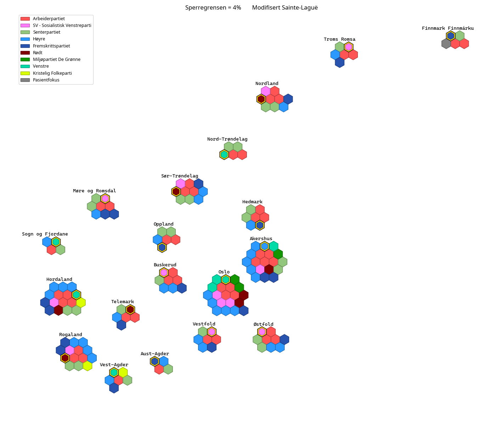

# Valgresultater med variasjoner på valgsystemet i Norge, samt helt andre valgsystem.
Valgresultatene for Stortingsvalget i Norge, 2021. Resultatene er eksportert fra valgresultat.no den 17. september (kan bli små endringer i ettertid).

Scroll ned for å se de faktiske resultatene.

## Forskjellige metoder:
- **Sperregrense 4%**
    - [Modifisert Sainte-Laguë (metoden vi faktisk bruker)](figs/sperregrense4/modf/README.md)
    - [Umodifisert Sainte-Laguë](figs/sperregrense4/unmodf/README.md)
- **Sperregrense 3%**
    - [Modifisert Sainte-Laguë](figs/sperregrense3/modf/README.md)
    - [Umodifisert Sainte-Laguë](figs/sperregrense3/unmodf/README.md)
- **Sperregrense 5%**
    - [Modifisert Sainte-Laguë](figs/sperregrense5/modf/README.md)
    - [Umodifisert Sainte-Laguë](figs/sperregrense5/unmodf/README.md)
- **Ingen sperregrense**
    - [Modifisert Sainte-Laguë](figs/sperregrense0/modf/README.md)
    - [Umodifisert Sainte-Laguë](figs/sperregrense0/unmodf/README.md)
- **Ingen utjevningsmandater**
    - [Modifisert Sainte-Laguë](figs/ingenutjvn/modf/README.md)
    - [Umodifisert Sainte-Laguë](figs/ingenutjvn/unmodf/README.md)
- **Absolutt grense på 4%**
    - [Modifisert Sainte-Laguë](figs/abs4/modf/README.md)
    - [Umodifisert Sainte-Laguë](figs/abs4/unmodf/README.md)
- **Endring i arealfaktoren for mandatfordeling på fylkene**
    - [Ingen arealfaktor](figs/areal/faktor0/README.md)
    - [Arealfaktor på 1](figs/areal/faktor1/README.md)
    - [Arealfaktor på 3](figs/areal/faktor3/README.md)
- **Hele landet som ett valgdistrikt**
    - [Ett valgdistrikt, 169 mandater](figs/ett_distrikt/README.md)
- **Amerikanske metoder (First Past The Post)**
    - [Fylkesfordelingen som normalt](figs/usaway/stdmandater/README.md)
    - [Mandatene utdelt til fylker som i USA (først én, deretter resten fordelt etter populasjon (Huntington-Hills metode), og deretter to ekstra til hvert fylke)](figs/usaway/usamandater/README.md)

## De faktiske valgresultatene (endringene til høyre viser forskjell fra faktisk resultat, altså null i dette tilfellet):  

### Stortinget med disse resultatene:  

### Kart som viser fordelingen av mandatene på valgdistriktene (gamle fylker):  
