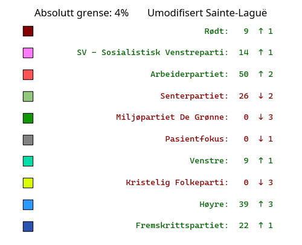
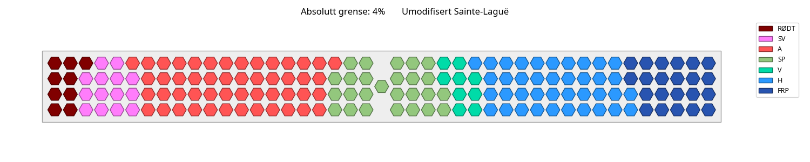
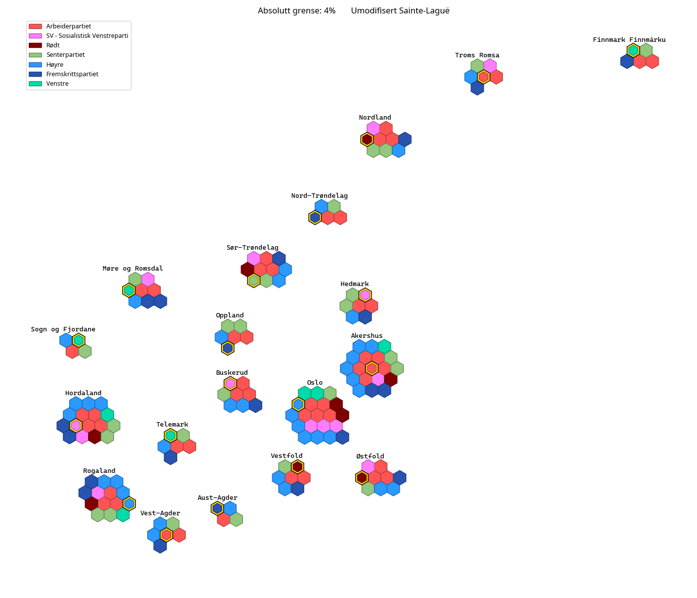

# Absolutt grense på 4% for å få mandater, umodifisert Sainte-Laguë

### Antall mandater (forskjell fra faktisk resultat til høyre):

### Stortinget med disse resultatene:  

### Kart som viser fordelingen av mandatene på valgdistriktene (gamle fylker):  
