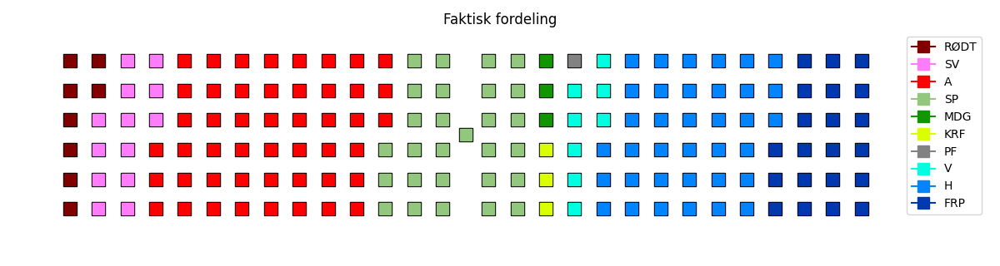
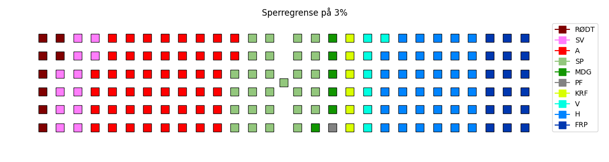
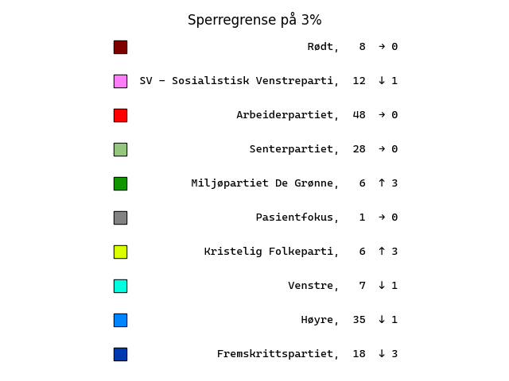
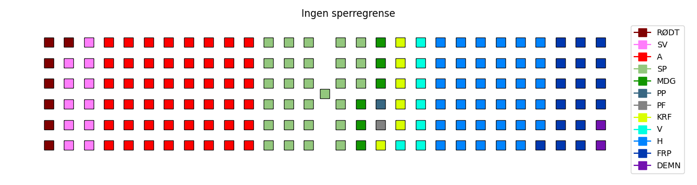
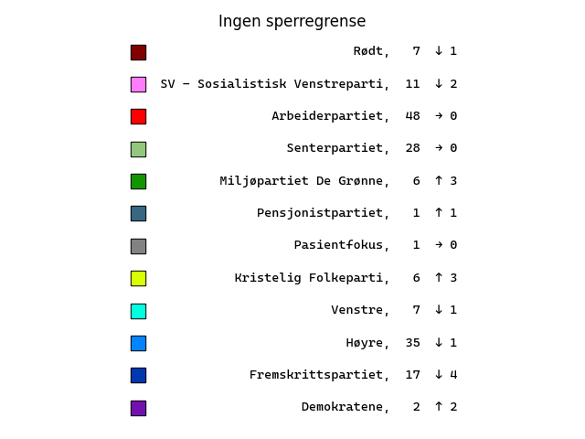
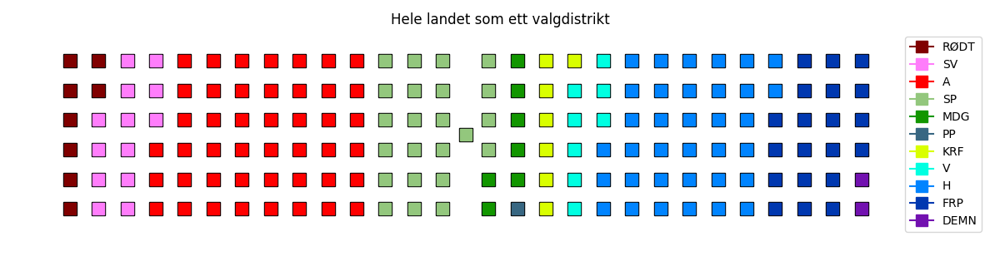
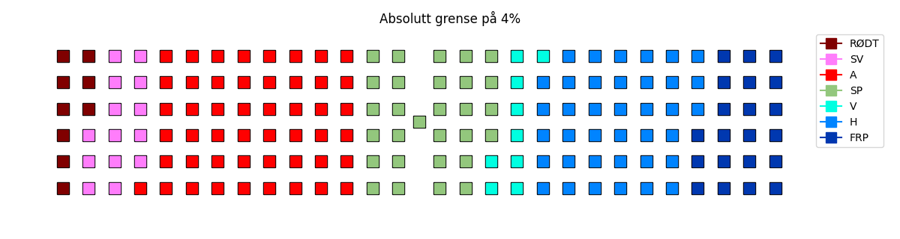

## Det faktiske valgresultatet:
### Stortinget:

### Antall mandater:

### Kart:

## Hva om sperregrensen var på 3%?
### Stortinget:

### Antall mandater (tallene til høyre viser forskjell fra faktisk resultat):

### Kart:

## Hva om sperregrensen var på 5%?
### Stortinget:

### Antall mandater (tallene til høyre viser forskjell fra faktisk resultat):

### Kart:

## Hva om det ikke var noen sperregrense?
### Stortinget:

### Antall mandater (tallene til høyre viser forskjell fra faktisk resultat):

### Kart:

## Hva om hele landet fungerte som ett stort valgdistrikt med 169 mandater?
### Stortinget:

### Antall mandater (tallene til høyre viser forskjell fra faktisk resultat):

## Hva om man måtte få mer enn 4% nasjonalt for å få mandater (også direktemandater)?
### Stortinget:

### Antall mandater (tallene til høyre viser forskjell fra faktisk resultat):

### Kart:
