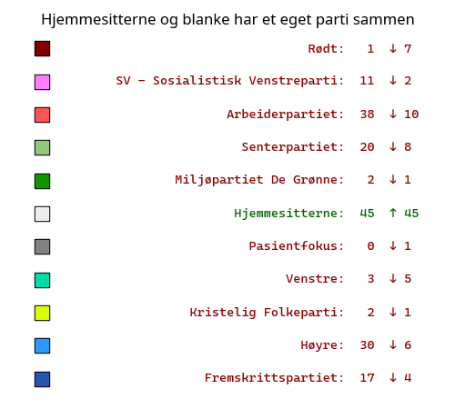
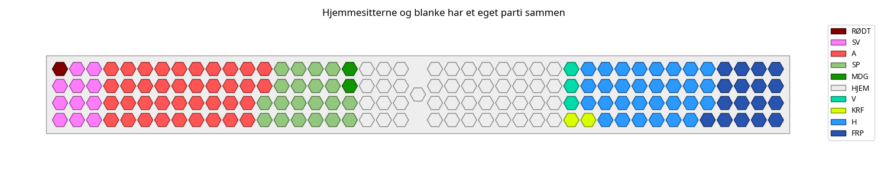
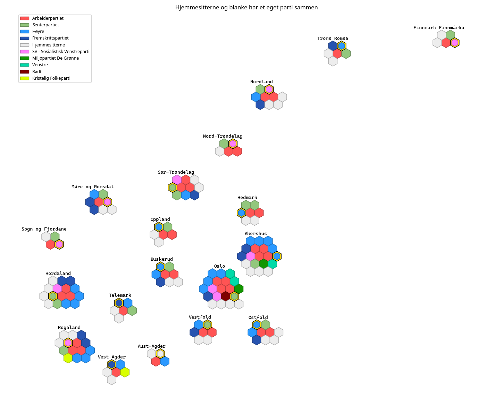
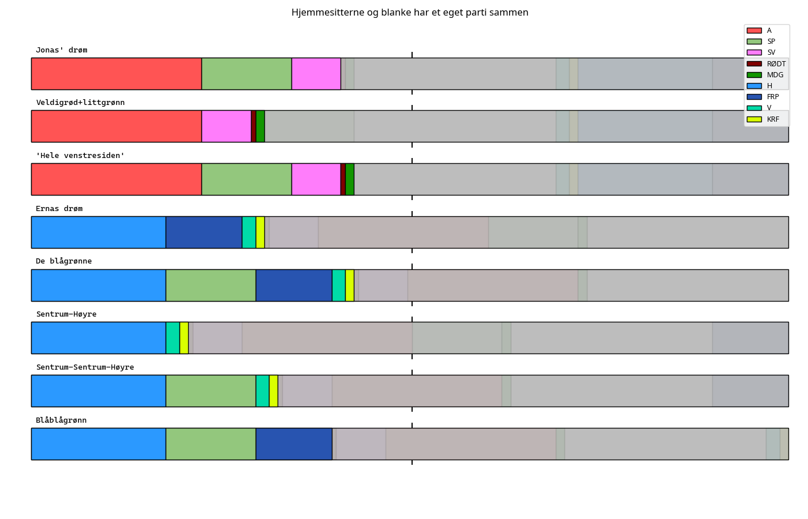

# Hjemmesitterne og blanke stemmer slår seg sammen til ett stort parti

### Antall mandater (forskjell fra faktisk resultat til høyre):

### Stortinget med disse resultatene:  

### Kart som viser fordelingen av mandatene på valgdistriktene (gamle fylker):  

### Forskjellige blokker:  
