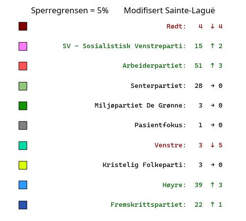
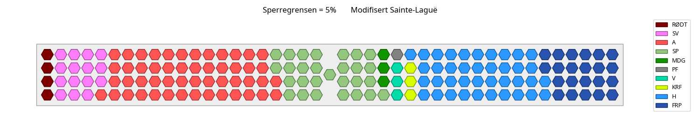
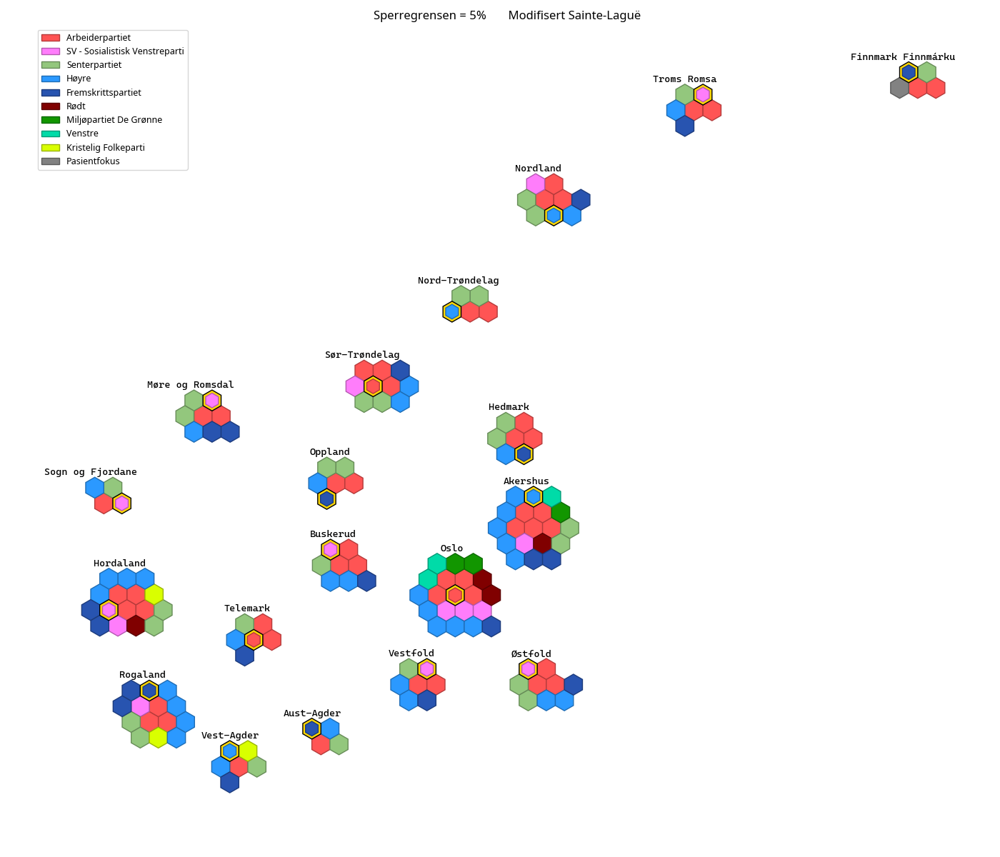

# Sperregrense på 5% og første delingstall 1,4 (modifisert Sainte-Laguë)

### Antall mandater (forskjell fra faktisk resultat til høyre):

### Stortinget med disse resultatene:  

### Kart som viser fordelingen av mandatene på valgdistriktene (gamle fylker):  

### Forskjellige blokker:  
