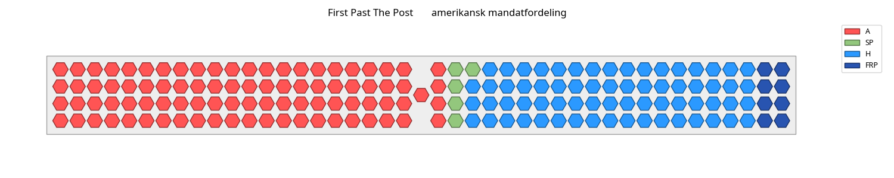
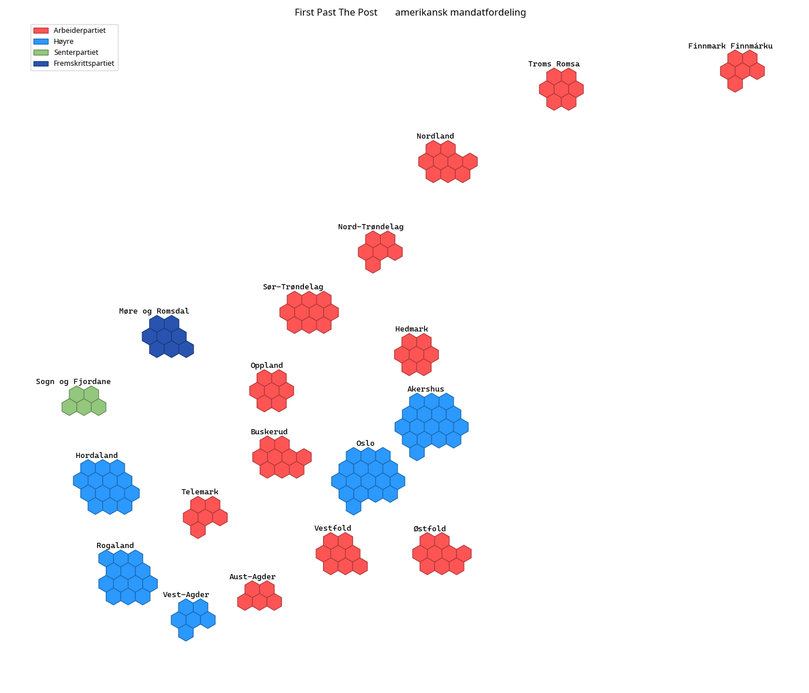

# Dersom fylkene tildeles mandater på samme måte som i USA, og vinneren tar alt i hvert fylke.

### Antall mandater (forskjell fra faktisk resultat til høyre):

### Stortinget med disse resultatene:  

### Kart som viser fordelingen av mandatene på valgdistriktene (gamle fylker):  
